# Database & Query

## Daftar Isi
1. [The Needs of Data Analyst](#1-the-needs-of-data-analyst)
2. [Database & SQL](#2-database--sql)
3. [Basic Select Statement](#3-basic-select-statement)
4. [Basic Filtering Data (WHERE)](#4-basic-filtering-data-where)
5. [Latihan](#latihan)

## 1. The Needs of Data Analyst
### Role of Data Analyst
- Memberikan analisis dari data yang dimiliki oleh perusahaan

### Workflow Data Analysis
1. Problem Definition
2. Data Collection
3. Data Processing and Validation
4. Analysis
5. Reporting

### Sumber data
Banyak tools yang tersedia untuk menyimpan data, yaitu Database. Contoh database yang populer adalah Oracle, SQL, MySQL, PostgreSQL, dll

### Contoh Arsitektur Data
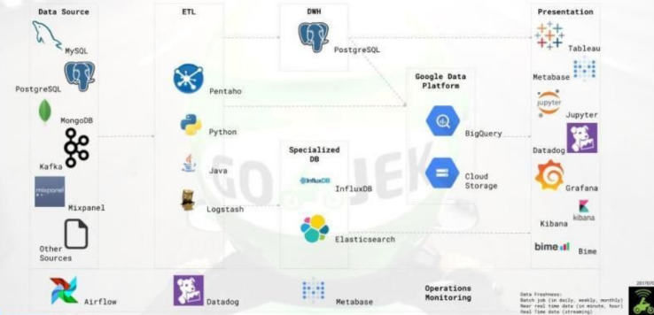

## 2. Database & SQL
Database adalah teknologi untuk menyimpan data

### Penyimpanan Data di Komputer Lokal
Penyimpanan data di database dapat diibaratkan dengan penyimpanan di komputer lokal. Dengan susunan
- Tempat penyimpanan data
- File yang berisi data
- Data yang disimpan dalam bentuk tabel
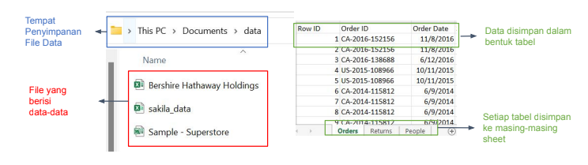

### Relational Database Management System (RDBMS)
Sama seperti komputer lokal, RDMBS terdiri dari
- Kumpulan database untuk menyimpan data
- Database terdiri dari banyak tabel
- Tabel berisi data-data
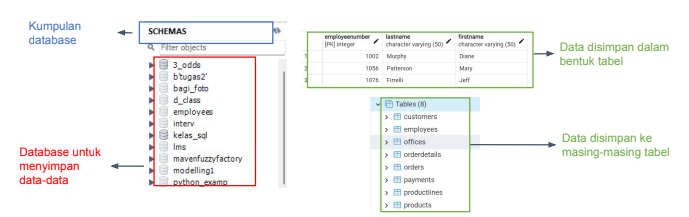

### Database
- Database adalah penyimpanan yang berisi kumpulan data atau informasi yang disimpan secara terorganisir
- untuk mempermudah pengelolaan database, dapat digunakan Database Management System (DBMS) 

### Relational DBMS
- RDBMS adalah salah satu DBSM yang sering digunakan
- RDBMS menyimpan data dalam bentuk tabel yang terhubung dengan tabel lainnya

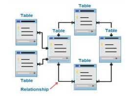

### SQL
- Dalam mengakses data dari relational database, digunakan perintah Structured Query Language (SQL)
- User akan membuat request data dengan SQL ke DBMS yang kemudian DBSM akan mengembalikan data yang dicari dan ditampilkan pada layar user/

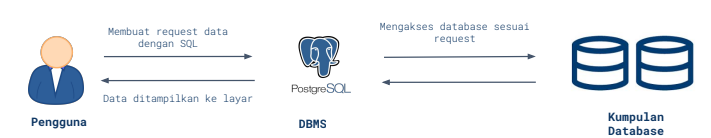

- Dengan menggunakan SQL, kita dapat mengakses data dengan cara:
    - Menentukan tabel yang akan diakses
    - Memilih kolom yang akan diakses
    - Melakukan filtering data
    - Menggabungkan beberapa tabel
    - Menambang fungsi lainnya untuk analisis

## 3. Basic Select Statement

Berikut adalah struktur dari query SQL:
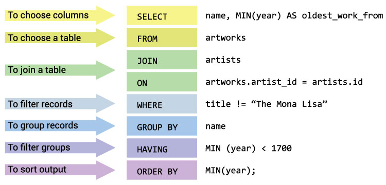

1. `SELECT` untuk memilih kolom mana yang ingin ditampilkan.
    - * untuk menampilkan semua kolom
    - dapat digunakan perhitungan, contoh salary*2
    - dapat digunakan fungsi aggregasi, seperti MIN(nama_kolom), MAX(nama_kolom), AVG(), COUNT(), SUM()
    - DISTINCT nama_kolom untuk mengakses data unik
2. `FROM` untuk memilih tabel
3. `JOIN` table_name2 `ON` table_name_column = table2_name_column untuk menggabungkan tabel
4. `WHERE` untuk melakukan filtering
5. `GROUP BY` untuk menggabungkan data
6. `HAVING` untuk filtering group
7. `ORDER BY` untuk mengurutkan output
8. `LIMIT` untuk membatasi jumlah output

## 4. Basic Filtering Data (WHERE)

1. Operator Perbandingan

    | Operator | Deskripsi |
    |----------|-----------|
    | =        | Membandingkan persamaan |
    | !=, <>   | Membandingkan ketidaksamaan |
    | <=       | Kurang dari atau sama dengan |
    | <        | Kurang dari |
    | >=       | Lebih dari atau sama dengan |
    | >        | Lebih dari |

    contoh: 

    Menampilkan data pegawai dengan kelahiran setelah 1970-01-01 pada tabel _employee_

    ```sql
    SELECT *
    FROM Employee
    WHERE birth_day > '1970-01-01'
    ```

2. Operator Logika

    | Operator | Deskripsi |
    |----------|-----------|
    | AND      | Kedua kondisi harus terpenuhi |
    | OR       | Salah satu kondisi harus terpenuhi |
    | NOT      | Kondisi tidak terpenuhi |

    contoh:

    Menampilkan data pegawai dengan kelahiran setelah 1970-01-01 dan gaji minimal 5000 pada tabel _employee_

    ```sql
    SELECT *
    FROM Employee
    WHERE birth_day > '1970-01-01' AND salary >= 5000
    ```

3. Operator Keanggotaan (IN, NOT IN)

    | Operator | Deskripsi |
    |----------|-----------|
    | IN       | Nilai sama dengan salah satu nilai dalam list |
    | NOT IN   | Nilai tidak sama dengan salah satu nilai dalam list |

    contoh:

    Menampilkan data pegawai yang disupervisi oleh Josh atau Michael

    ```sql
    SELECT *
    FROM Employee
    WHERE supervisor_name IN ('Josh', 'Michael')
    ```
4. Operator Matching (LIKE, NOT LIKE)

    | Operator | Deskripsi |
    |----------|-----------|
    | LIKE     | Nilai sama dengan pattern |
    | NOT LIKE | Nilai tidak sama dengan pattern |

    | Kemungkinan Pattern | Deskripsi |
    | ------------------- | --------- |
    | %AN                 | Memiliki akhiran AN |
    | AN%                 | Memiliki awalan AN |
    | %AN%                | Memiliki AN |
    | _AN                 | Memiliki AN pada posisi kedua dan ketiga |

    contoh:

    Menampilkan data pegawai dengan nama yang diawali huruf 'A'

    ```sql
    SELECT *
    FROM Employee
    WHERE name LIKE 'A%'
    ```

5. Operator Range (BETWEEN, NOT BETWEEN)
    
    | Operator | Deskripsi |
    |----------|-----------|
    | BETWEEN  | Nilai berada dalam range |
    | NOT BETWEEN | Nilai tidak berada dalam range |

    contoh:

    Menampilkan data pegawai dengan gaji antara 3000 dan 5000

    ```sql
    SELECT *
    FROM Employee
    WHERE salary BETWEEN 3000 AND 5000
    ```

6. Operator Null (IS NULL, IS NOT NULL)

    | Operator | Deskripsi |
    |----------|-----------|
    | IS NULL  | Nilai NULL |
    | IS NOT NULL | Nilai bukan NULL |

    contoh:

    Menampilkan data pegawai yang tidak memiliki supervisor

    ```sql
    SELECT *
    FROM Employee
    WHERE supervisor_name IS NULL
    ```

## Latihan

### Overview

Toko Cars merupakan toko mainan miniatur kendaraan. Pemilik toko baru saja menunjuk manager baru dan memintanya untuk mengenali proses bisnis dari toko tersebut. Yoko tersebut memiliki database yang menyimpan informasi mengenai proses bisnis di tokonya.


### CASE 1

Manager ingin mengetahui produk yang ada di toko Cars

Mengecek isi dari tabel _products_

```sql
SELECT *
FROM products
LIMIT 5;
```

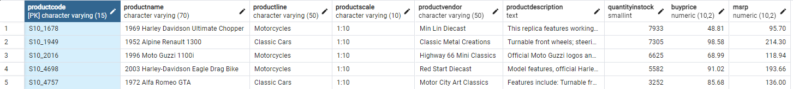
Informasi yang didapatkan
1. Tabel berisi 9 kolom:
    - productcode
    - productname
    - productline
    - productscale
    - productvendor
    - productdescription
    - quantityinstock
    - buyprice
    - msrp

- Manager ingin mengetahui apa saja kategori produk yang ada di toko cars

    ```sql
    SELECT DISTINCT(productline)
    FROM products
    ```

    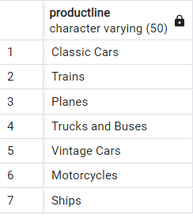

- Manager ingin mengetahui 5 produk termurah yang dibeli oleh toko

    ```sql
    SELECT productname, buyprice
    FROM products
    ORDER BY buyprice ASC
    LIMIT 5;
    ```
    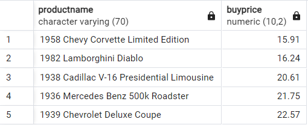


- Manager ingin melakukan simulasi penjualan, jika harga jual produk ditentukan 10% lebih kecil dari MSRP (manufacturer suggested retail price) atau harga eceran yang disarankan, seperti apa proyeksi total penjualan untuk tiap produk jika semua stock terjual habis. 
  
    Langkah-langkah:
    
    1. hitung harga jual yang 10% lebih kecil dari MSRP
    2. hitung total penjualan dengan mengkalikan harga jual dan jumlah stok

    ```sql
    SELECT 
		productname, 
		quantityinstock, 
		msrp*0.9 AS saleprice, 
		quantityinstock * msrp * 0.9 AS totalsales
    FROM products
    ORDER BY productname;
    ```
    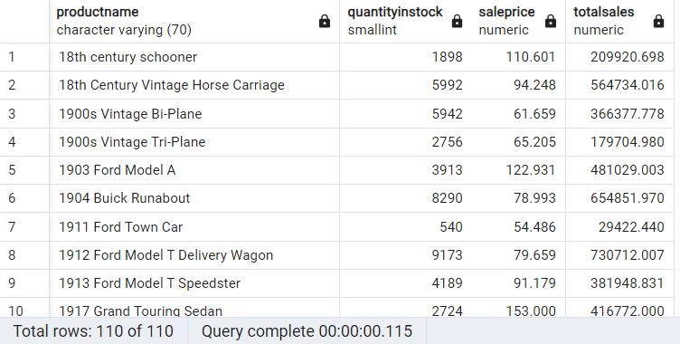


- Jika manager menetapkan harga jual 10% dibawah MSRP. Tampilkan 10 produk yang akan menghasilkan profit terbanyak bagi perusahaan jika semua produk terjual habis
  Langkah-langkah:
  
  1. hitung harga jual
  2. hitung margin produk (harga jual - harga beli)
  3. hitung revenue dengan kalikan margin dengan total stok
  4. urutkan revenue dari yang terbesar
  5. limit 10
   
   ```sql
   SELECT 
		productname,
		quantityinstock,
		buyprice,
		msrp*0.9 AS salesprice,
		msrp*0.9 - buyprice AS margin,
		(msrp*0.9 - buyprice) * quantityinstock AS revenue
    FROM products
    ORDER BY (msrp*0.9 - buyprice) * quantityinstock DESC
    LIMIT 10;
    ```
    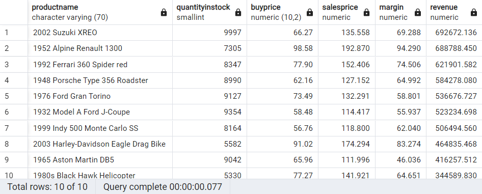

### CASE 2
Manager toko ingin mengetahui lebih jauh tentang customer yang berkaitan dengan payments

Mengecek isi dari tabel _customers_

```sql
SELECT *
FROM customers
LIMIT 5;

SELECT *
FROM payments
LIMIT 5;
```

- Tabel _customers_ terdiri dari:
  - customernumber
  - customername
  - contactlastname
  - phone
  - addressline1
  - addressline2
  - city
  - state
  - postalcode
  - country
  - salesrepemployeenumber
  - creditlimit

- Tabel _payments_ terdiri dari:
  - customernumber
  - checknumber
  - paymentdate
  - amount

- Manager ingin mengetahui siapa saja customer yang masuk kategori **incorporated company** yang dicirikan dengan namanya mengandung 'Inc'

    ```sql
    SELECT customername
    FROM customers
    WHERE customername LIKE %Inc%
    ```
    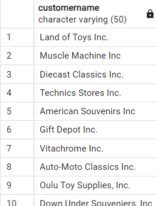

- Sehubungan dengan perayaan hari jadi kota New York (NYC), Brickhaven, dan San Francisco serta Negara Japan, manager ingin mengadakan program khusus di kota / negara tersebut. Untuk itu, dia ingin mengetahui customer yang berasal dari kota-kota / negara tersebut

    ```sql
    SELECT 
        customername, 
        city, 
        country
    FROM customers
    WHERE city IN ('NYC', 'Brickhaven','San Francisco') OR country = 'Japan';
    ```

    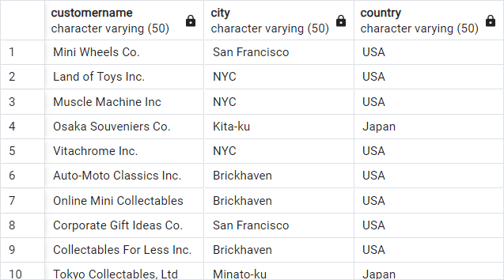

- Untuk meningkatkan transaksi, manager akan membuat diskon pada customer yang masih memiliki credit limit dan berasal dari negara Amerika. Dapatkanlah informasi customer tersebut

    ```sql
    SELECT 
        customername,
        contactlastname,
        phone,
        country,
        creditlimit
    FROM customers
    WHERE country = 'USA' AND creditlimit > 0;
    ```
    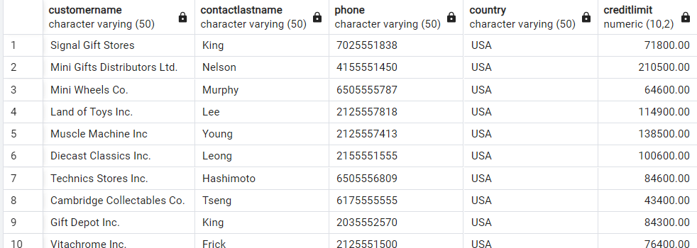

- Sebagai bentuk apresiasi, toko ingin memberikan hadiah kepada customer yang nilai transaksinya masuk ke 10 transaksi paling besar.

    ```sql
    SELECT *
    FROM payments
    ORDER BY amount DESC
    LIMIT 10;
    ```

    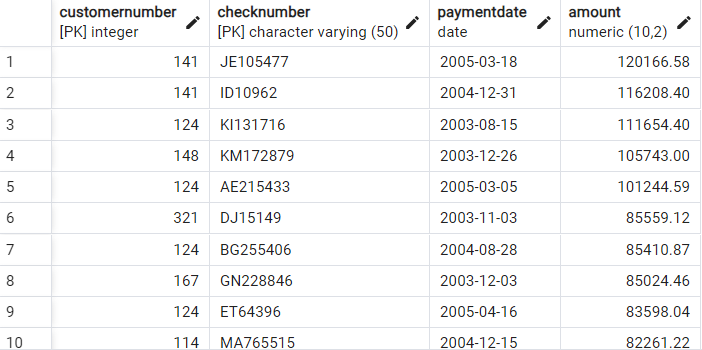