# Aggregation and Window Function

1. Aggregate Function
2. Grouping
3. Window Function


## 1. Aggregation Function
Meringkas data dengan melihat statistik deskriptif

| Function | Description |
| --- | --- |
| COUNT() | jumlah baris |
| SUM() | total nilai |
| AVG() | rata-rata |
| MIN() | nilai minimum |
| MAX() | nilai maksimum |
|STDDEV()| standar deviasi |
|VARIANCE()| variansi |

contoh:
```sql
SELECT COUNT(*), SUM(salary), AVG(salary), MIN(salary), MAX(salary), STDDEV(salary), VARIANCE(salary)
FROM employees;
```

> Notes Agregation terhadap nilai NULL:
>-  Secara umum, fungsi agregasi tidak akan menghitung baris yang bertipe NULL.
> - Pengecualian terhadap COUNT(*) yang akan tetap menghitung baris berisi NULL.
> - Fungsi agregasi juga akan mengembalikan NULL pada kolom yang berisi NULL
> - Pengecualian terhadap COUNT() yang akan mengembalikan O.

## 2. Grouping
Melakukan aggregasi data berdasarkan pengelompokkan kategori tertentu. Grouping bertujuan untuk mengelompokkan data yang memiliki nilai identik.

contoh:
```sql
SELECT department_id, COUNT(*), SUM(salary), AVG(salary), MIN(salary), MAX(salary), STDDEV(salary), VARIANCE(salary)
FROM employees
GROUP BY department_id;
HAVING COUNT(*) > 1;
```

> Notes:
> - Kolom yang dipanggil (selain kolom yang di aggregasi) harus ada dalam klausa GROUP BY
> - tambahkan klausa HAVING untuk melakukan filter terhadap hasil aggregasi


## 3. Window Function
Window function adalah pengelompokan yang lebih dinamis karena dapat beroperasi pada baris secara individu. Mengembalikkan nilai dengan jumlah baris sesuai dengan baris awal. Window function dapat memotong dan mengurutkan data berdasarkan kolom tertentu.

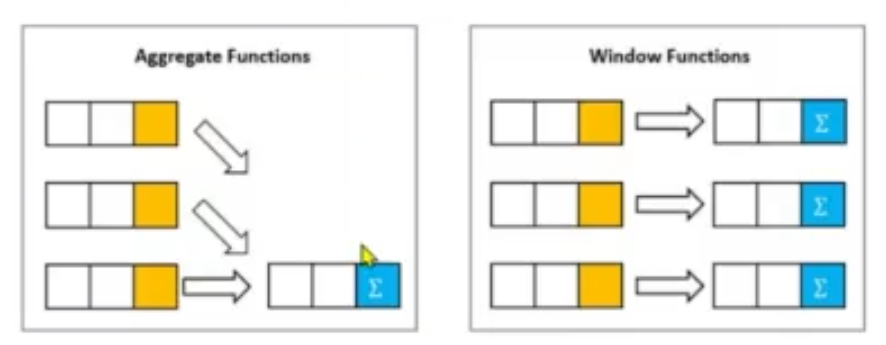

contoh:
```sql
    SELECT city, Temp, AVG(Temp) OVER() AS AvgTemp
    FROM temp;
```
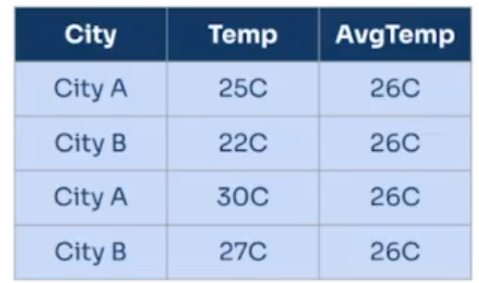

`PARTITION BY` digunakan untuk membagi data menjadi beberapa kelompok berdasarkan kolom tertentu.

contoh:
```sql
    SELECT city, Temp, AVG(Temp) OVER(PARTITION BY city) AS AvgTemp
    FROM temp;
```
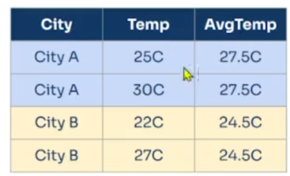

`ORDER BY` digunakan untuk mengurutkan data sebelum dilakukan operasi window function.

contoh:
```sql
    SELECT city, Temp, AVG(Temp) OVER(PARTITION BY city ORDER BY Temp DESC) AS AvgTemp
    FROM temp;
```
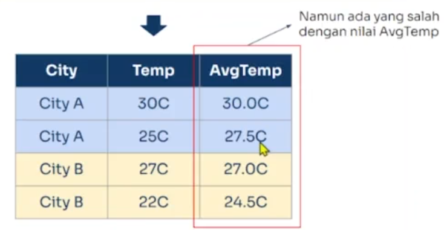

perlu ditambahkan `Frame Clause` untuk menentukan batasan jumlah baris yang akan dioperasikan.

```sql
    SELECT City, Temp,
    AVG(Temp) OVER(PARTITION BY City ORDER BY Temp DESC `frame_unit` `frame_boundary`) AS AvgTemp
    FROM temp;
```

1. frame_unit dapat bernilai `RANGE` dari setiap partisinya
2. frame_boundary dapat bernilai BETWEEN `frame_start` AND `frame_end`
   frame_start dapat terdiri atas:
   - `CURRENT ROW`: batas bawah dari frame
   - `UNBOUNDED PRECEDING` : batas atas dari frame
   - `n PRECEDING` : batas atas dari frame sebanyak n baris dari atas
  
    frame_end dapat terdiri atas:
    - `CURRENT ROW`
    - `UNBOUNDED FOLLOWING` : batas bawah dari frame
    - `n FOLLOWING` : batas bawah dari frame sebanyak n baris dari bawah

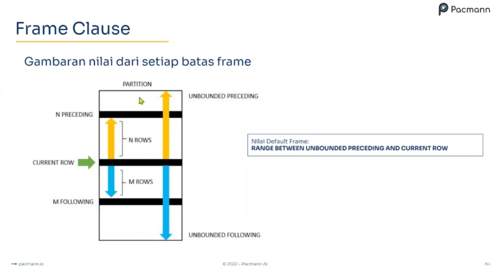

Nilai default frame
```
RANGE BETWEEN UNBOUNDED PRECEDING AND CURRENT ROW
-- Batas atas akan tetap dan batas bawah akan bergerak sesuai banyaknya data
```

Jadi, tanpa menambahkan frame_clause, maka frame_clause akan diisi dengan nilai default. sehingga hasil avg yang diperoleh tidak sama untuk setiap baris. Hal ini disebabkan karena frame_start UNBOUNDED PRECEDING yang berarti batas atas akan tetap dan frame_end CURRENT ROW yang berarti batas bawah akan bergerak sesuai banyaknya data.

default:
```sql
    SELECT City, Temp,
    AVG(Temp) OVER(PARTITION BY City ORDER BY Temp DESC RANGE BETWEEN UNBOUNDED PRECEDING AND CURRENT ROW) AS AvgTemp
    FROM temp;
```
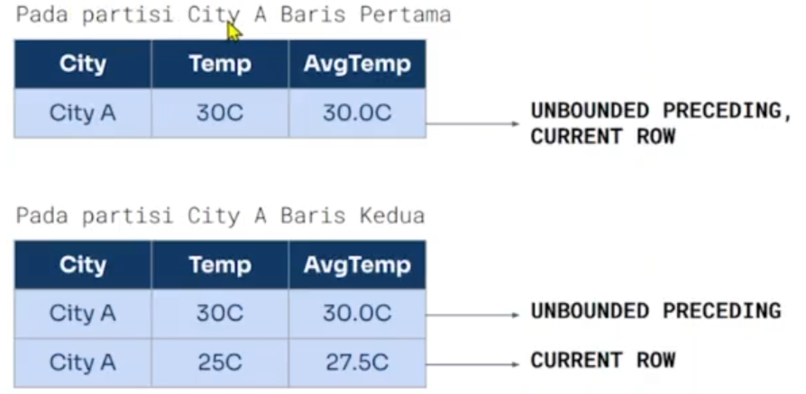
- Pada baris pertama, batas bawahnya adalah baris pertama
- Pada baris kedua, batas bawahnya adalah baris kedua
- Hal ini menyebabkan nilai rata-rata yang diperoleh tidak sama untuk setiap baris

perbaikan:
```sql
    SELECT City, Temp,
    AVG(Temp) OVER(PARTITION BY City ORDER BY Temp DESC RANGE BETWEEN UNBOUNDED PRECEDING AND UNBOUNDED FOLLOWING) AS AvgTemp
    FROM temp;
```
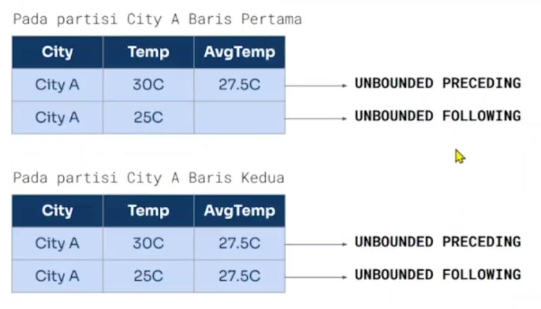

default windows function query:


- Selain fungsi agregat, terdapat fungsi lain yang dapat dikombinasikan dengan window function, yaitu Ranking dan Analytic Function.

| Rangking Function | Keterangan |
| --- | --- |
| CUME_DIST() | nilai distribusi kumulatif |
| ROW_NUMBER() | jumlah baris ke-N dalam partisinya |
| RANK() | peringkat baris ke-N dalam partisinya dengan "celah" |
| DENSE_RANK() | peringkat baris ke-N dalam partisinya tanpa "celah" |
| PERCENT_RANK() | nilai peringkat persentase |
| NTILE() | Golongan persentil ke-N sesuai dengan jumlah pembagian yang ditentukan |

| Analytic Function | Keterangan |
| --- | --- |
| LAG() | nilai dari baris yang tertinggal dari baris ke-N dalam partisi |
| LEAD() | melihat nilai pada posisi tertentu setelah baris saat ini |
| FIRST_VALUE() | nilai dari baris pertama pada frame |
| LAST_VALUE() | nilai dari baris terakhir pada frame |
| NTH_VALUE | nilai dari baris ke-N pada frame |

## Latihan

### Aggregation Case

- Toko ingin melihat kelengkapan stock di gudangnya. Hal ini untuk menentukan apakah jumlah stock barang masih mencukupi. Coba analisis ketersediaan stock dengan mencari jumlah totalnya.

    ```sql
    SELECT SUM(quantityinstock) AS TotalStock
    FROM products;
    ```
    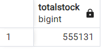

- Kemudian operasional gudang toko ingin melihat variasi dari jenis barang pada gudang. Variasi barang yang memiliki jumlah yang sedikit akan ditambahkan variasinya. Variasi barang kurang dari 5 maka akna ditampilkan variasi barangnya. Carilah jumlah variasi barang kurang dari 5 berdasarkan jenis produk yang dijual

    - Hitung distinct productname
    - Group by productline
    - having distint productname < 5


    ```sql
    SELECT productline, COUNT(DISTINCT(productname)) AS productcount
    FROM products
    GROUP BY productline
    HAVING COUNT(DISTINCT(productname)) < 5;
    ```

    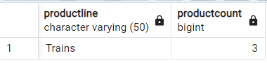

- Pada tahap akhir kegiatan restock, toko ingin membandingkan stock barang dengan rata-ratanya agar nanti stock barang yang kurang dari rata-rata dapat di restock. Bandingkan stock barang dengan rata-ratanya

    ```sql
    SELECT 
        productname, 
        quantityinstock, 
        AVG(quantityinstock)
    FROM products
    GROUP BY productname, quantityinstock;
    ```

    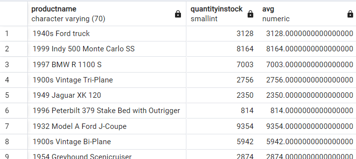
    - Hasil query tidak representatif karena hanya merepetisi nilai yang ada pada kolom stock. Hal ini merupakan batasan dari aggregasi dan grouping. Untuk mengatasi hal ini, kita dapat menggunakan window function.

### Window Function Case

- Carilah perbandingan stock barang dengan stock rata-rata secara keseluruhan berdasarkan productline

    ```sql
    SELECT
	productname,
	productline,
	quantityinstock,
	AVG(quantityinstock) OVER(PARTITION BY productline) AS AvgStock
    FROM products;
    ```
    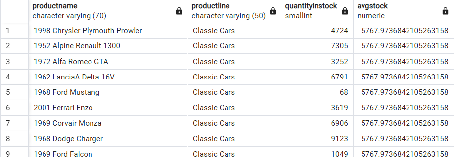

- Toko ingin melihat apakah suatu barang mempengaruhi kuantitas pembelian, apakah jika barang semakin mahal maka akan semakin sedikit yang beli? sebaliknya, apakah jika barang semakin murah maka akan semakin banyak yang beli? Lakukan analisis terhadap perbandingan harga dan kuantitas pembelian barang

    - Cari product, priceeach, dan quantityordered
    - Hitung rank. Untuk melihat apakah harga yang tinggi akan menghasilkan sedikit pembeli, kita perlu menghitung rank dari harga yang tinggi ke rendah dan pembeli yang sedikit ke banyak
    - gunakan dense_rank() priceeach desc dan quantityordered asc
    - Lihat nilai rank. Apabila rank keduanya sama, maka terbukti bahwa harga yang tinggi akan menghasilkan sedikit pembeli begitupun sebaliknya

    ```sql
    SELECT 
	productcode,
	priceeach,
	quantityordered,
	DENSE_RANK() OVER(ORDER BY priceeach DESC) AS pricerank,
	DENSE_RANK() OVER(ORDER BY quantityordered ASC) AS qtyrank
    FROM orderdetails
    ORDER BY qtyrank;
    ```
    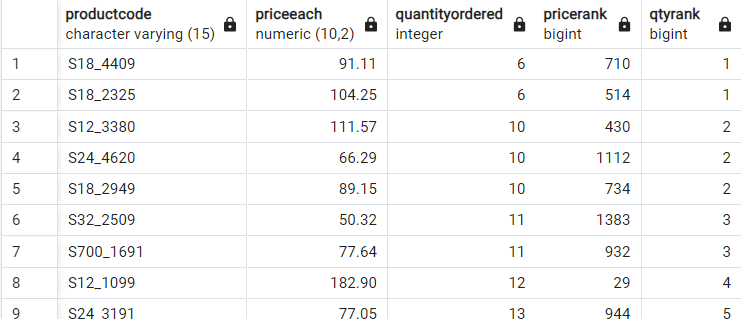
    - Berdasarkan hasil yang didapatkan pernyataan bahwa harga yang tinggi akan menghasilkan sedikit pembeli tidak terbukti benar
    - dapat dilihat pada rank harga dan kuantiti yang tidak beraturan.


- Kemudian, toko ingin melihat karakteristik customer dengan membandingkan tanggal pembelian dengan pembelian selanjutnya beserta harga belinya. Hal tersebut untuk menjawab berapa lama yang dibutuhkan customer untuk melakukan pembelian selanjutnya dan apakah pembelian selanjutnya jumlah yang dibeli naik atau turun?
- Cari perbandingan masing-masing tanggal pembelian dengan pembelian selanjutnya beserta jumlah pembayarannya


    - cari customernumber, paymentdate, dan amount
    - cari next paymentdate dan next amount dengan lead() dan partition by customernumber
  
    ```sql
    SELECT
	customernumber,
	paymentdate,
	amount,
 	LEAD(paymentdate,1) OVER(PARTITION BY customernumber 
		ORDER BY paymentdate ASC RANGE BETWEEN UNBOUNDED PRECEDING 
		AND CURRENT ROW) AS nextpaymentdate,
	LEAD(amount,1) OVER(PARTITION BY customernumber
		ORDER BY paymentdate ASC RANGE BETWEEN UNBOUNDED PRECEDING
		AND CURRENT ROW) AS nextamount
    FROM payments;
    ```
    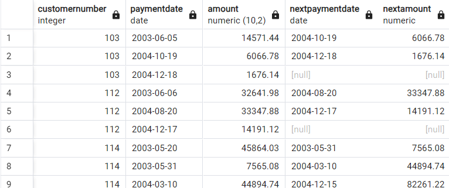

- Terakhir, toko ingin melihat harga termahal ke-N pada setiap jenis miniatur, kemudian membandingkannya dengan seluruh jenis produk yang ada pada setiap miniatur
- cari perbandingan harga termahal ke-N pada setiap jenis produk pada setiap jenis miniatur

    - cari productname, productline, dan buyprice
    - cari harga termahal ke-N pada setiap jenis produk (productline) dengan NTH_VALUE() dan partition by productline

    ```sql
    SELECT
	productname,
	productline,
	buyprice,
	NTH_VALUE(productname, 4) OVER(PARTITION BY productline ORDER BY buyprice DESC
	RANGE BETWEEN UNBOUNDED PRECEDING AND UNBOUNDED FOLLOWING) AS fourth_most_expensive_product, 
	NTH_VALUE(buyprice, 4) OVER(PARTITION BY productline ORDER BY buyprice DESC
	RANGE BETWEEN UNBOUNDED PRECEDING AND UNBOUNDED FOLLOWING) AS fourth_most_expensive
    FROM products;

    ```
    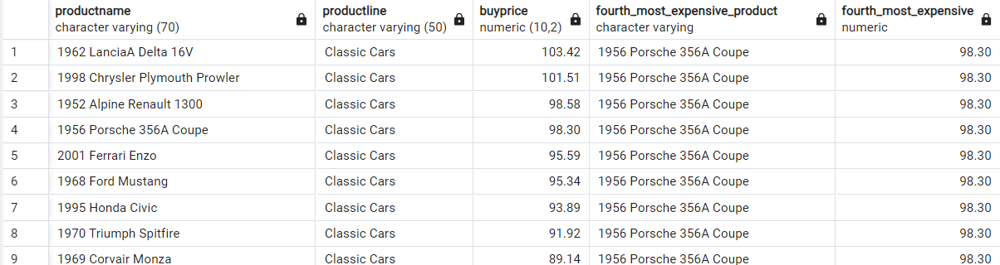