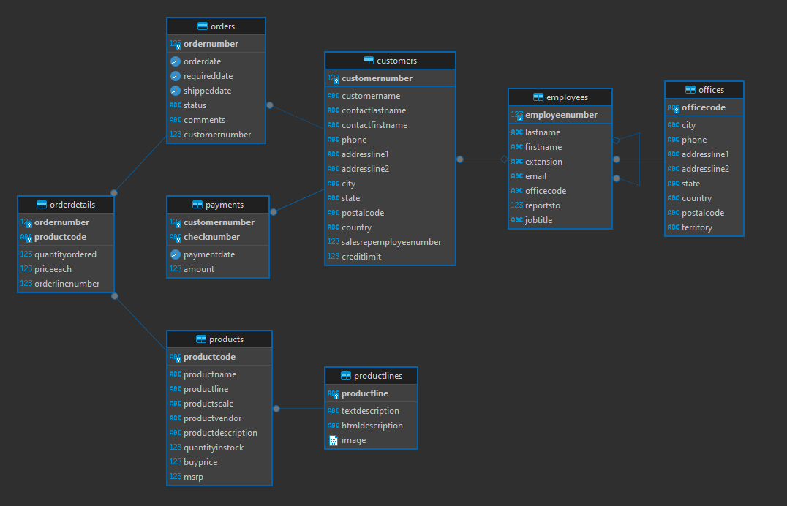
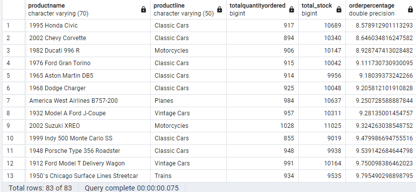
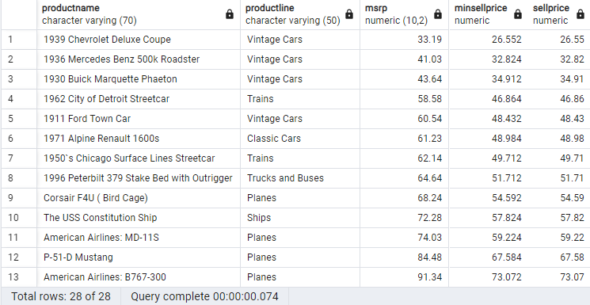

# Joining Data and Temporary Table


## Relation in Database
Untuk mengakses data dari dua tabel yang berbeda, diperlukan relasi antara kedua tabel tersebut.

Dua buah tabel dapat berelasi jika:
1. Terdapat kolom yang nilainya sama antara dua tabel atau lebih    
2. Kedua tabel dibuatkan relasinya saat proses pembuatan tabel.

Untuk melihat relasi semua table di dalam database dapat menggunakan Entity Relationship Diagram (ERD). ERD adalah diagram yang menggambarkan hubungan antara entitas dalam database. ERD terdiri dari entitas, atribut, dan relasi antar entitas.


- Tabel Relation
    
    - Kolom yang menghubungkan dua tabel disebut dengan Key
    - Key yang berada di tabel utama disebut Primary Key
    - Key yang berada di tabel kedua disebut Foreign Key 


## Joins

Joins adalah operasi yang digunakan untuk menggabungkan dua tabel berdasarkan kolom yang memiliki nilai yang sama. Terdapat beberapa jenis join, yaitu:

1. `Inner Join` mengembalikan data yang memiliki nilai yang sama di kedua tabel.

    

    ```sql
    SELECT column_name(s)
    FROM table1
    INNER JOIN table2
    ON table1.column_name = table2.column_name;
    ```
2. `Left Join` mengembalikan semua data dari tabel kiri dan digabungkan dengan data yang memiliki nilai yang sama di tabel kanan. Data yang tidak memiliki nilai akan diisi dengan NULL.


    

    ```sql
    SELECT column_name(s)
    FROM table1
    LEFT JOIN table2
    ON table1.column_name = table2.column_name;
    ```

3. `Right Join` mengembalikan semua data dari tabel kanan dan digabungkan dengan data yang memiliki nilai yang sama di tabel kiri. Data yang tidak memiliki nilai akan diisi dengan NULL.

    

    ```sql
    SELECT column_name(s)
    FROM table1
    RIGHT JOIN table2
    ON table1.column_name = table2.column_name;
    ```


## Sub Query

Sub Query adalah query yang berada di dalam query lain. Sub Query dapat digunakan untuk mencari data yang akan digunakan untuk filtering. Contoh: kita ingin mengembalikan data yang memiliki salary diatas rata-rata. Untuk mencari nilai salary rata-rata, kita dapat menggunakan Sub Query.

- Contoh kasus

    - Perusahaan ingin mencari siapa saja customer yang nilai transaksinya diatas rata-rata. Apabila kita menghitung rata-rata transaksi terlebih dahulu, hasilnya tidak akan representatif karena ketika data bertambah maka rata-rata akan berubah. Oleh karena itu, kita dapat menggunakan Sub Query untuk mencari nilai rata-rata transaksi.

    ```sql
    SELECT id_customer, tgl_transaksi, jumlah_pembayaran
    FROM payments
    WHERE jumlah_pembayaran > (SELECT AVG(jumlah_pembayaran) avg_transaksi FROM payments);
    ```

    - Bagaimana jika kita ingin mencari nilai minimum dari hasil sebelumnya? Kita dapat memasukkan query sebelumnya sebagai sub query dari query baru untuk mencari nilai minimum.

    ```sql
        SELECT MIN(jumlah_pembayaran)
        FROM (
            SELECT id_customer, tgl_transaksi, jumlah_pembayaran
            FROM payments
            WHERE jumlah_pembayaran > (
                SELECT AVG(jumlah_pembayaran) avg_transaksi
                FROM payments
            )
        ) AS transac_above_avg;
    ```

    > Notes: Sub query pada klausa from biasa disebut derived table dan membutuhkan alias pada saat dibuat.


    Dengan demikian, Sub Query dapat ditempatkan pada:
    - Klausa `WHERE` sebagai parameter filter
    - Klausa `FROM` / `JOIN` sebagai tabel acuan


    Syntax Sub Query:
    ```sql
    SELECT nama_kolom, fungsi_agregat(nama_kolom)
    FROM (sub-quary) AS alias
    JOIN table_2
    ON alias.column_name = table_2.column_name
    WHERE condition (sub-query)
    GROUP BY nama_kolom
    HAVING kondisi
    ORDER BY nama_kolom
    LIMIT jumlah_baris
    ```

## Common Table Expression (CTE)

   Sub Query dapat membuat query terlihat kompleks sehingga readability menjadi menurun. Untuk mengurangi kompleksitas, kita dapat menggunakan `Common Table Expression` (CTE). CTE adalah query yang didefinisikan sebelum query utama dan dapat digunakan sebagai tabel sementara.

    ```sql

    WITH nama_alias AS (
        SELECT column_name(s)
        FROM table_name
        WHERE condition
    )

    ```

   Contoh kasus
    - Perusahaan ingin memberikan diskon khusus kepada user yang __total transaksinya__ diatas rata-rata. Untuk itu perusahaan membutuhkan informasi nama, email, dan total transaksi dari user-user tersebut.

   

1. Membuat tabel CTE total transaksi dari tiap customer

     ```sql
        WITH total_transaction AS (
            SELECT payments.id_customer, SUM(jumlah_pembayaran) AS jumlah_pembayaran
            FROM payments
            JOIN customer2
            ON payments.id_customer = customer2.id_customer
            GROUP BY payments.id_customer
        )
    ```
    
2. Menggabungkan tabel total transaksi dengan tabel customer untuk mendapatkan informasi nama dan alamat email

    ```sql
        SELECT nama_customer, email, jumlah_pembayaran
        FROM total_transaction
        JOIN customer2
        ON total_transaction.id_customer = customer2.id_customer
        WHERE jumlah pembayaran < (SELECT AVG(jumlah_pembayaran) FROM total_transaction);
     ```


## Temporary Table

Keterbatasan CTE

- CTE hanya dapat dipanggil pada query tersebut
- Kurang efektif jika tabel hasil query akan diakses banyak query lainnya.

Temporary Table
- Temporary Table adalah tabel sementara yang dibuat untuk menyimpan hasil query.
    
- Namun tabel temporer hanya dapat diakses selama satu sesi login saja


Contoh kasus yang sama

Perusahan ingin memberikan hadiah kepada user yang total transaksinya diatas rata-rata. Untuk itu perusahaan membutuhkan informasi nama, email, dan total transaksi dari user-user tersebut.


1. Membuat tabel tempoper total transaksi dari tiap customer

        ```sql
        CREATE TEMPORARY TABLE total_transaction AS (
            SELECT payments.id_customer, SUM (jumlah_pembayaran) AS jumlah_pembayaran
            FROM payments
            JOIN customer2
            ON payments.id_customer = customer2.id_customer
            GROUP BY payments.id_customer
        )

        > Kita dapaat mengecek apakah tabel temporer sudah dibuat dengan perintah SELECT * nama_tabel

 2. Membuat tabel temporer rata-rata total transaksi dari tiap customer

        ```sql
        CREATE TEMPORARY TABLE avg_transac AS
        SELECT AVG(jumlah_pembayaran) AS avg_transaksi
        FROM total_transaction;
        ```

3. Menggabungkan tabel total transaksi dengan tabel customer untuk mendapatkan informasi nama dan email

        ```sql
        SELECT nama_customer, email, jumlah_pembayaran
        FROM total_transaction
        JOIN customers2
        ON total_transaction.id_customer = customers2.id_customer
        WHERE jumlah_pembayaran > (SELECT * FROM avg_transac);
        ```


## Latihan

### Overview

Toko Cars merupakan toko mainan miniatur kendaraan. Toko tersebut memiliki database yang menyimpan informasi mengenai proses bisnis tokonya. Pemilik toko ingin menganalisis database yang dipunyai tersebut.

### ERD DATABASE



CASE 1

1. Toko berencana membuat strategi untuk mempercepat penjualan barang yang belum laku sama sekali lewat skema diskon. Karena itu, Pemilik toko meminta anda untuk mencari data barang yang belum pernah dibeli oleh customer.

    - Lihat tabel mana yang memiliki informasi nama barang dan terjual
    - Tabel `products` memiliki informasi nama barang dan tabel `order_details` memiliki informasi barang yang terjual

    ```sql
    SELECT 
        productname, 
        productline,
        quantityordered
    FROM products
    LEFT JOIN orderdetails
    ON products.productcode = orderdetails.productcode
    WHERE quantityordered IS NULL;

    ```

2. Melanjutkan strategi penjualan dengan skema diskon. Pemilik toko juga akan memberikan diskon untuk produk yang persentase jumlah penjualannya dibawah 30% dari total stock yang ada. Carilah barang yang persentase terjualnya kurang dari 30% dari total stock yang ada. total stok = stok saat ini + jumlah terjual

    - Tabel yang memiliki informasi jumlah stok dan jumlah terjual adalah tabel `products` dan `orderdetails`
    - hotung setiap stok terjual berapa
    - hitung total stok
    - hitung persentase terjual
    - filter barang yang persentase terjualnya kurang dari 30%


    - buat temp tabel untuk menyimpan total order dari setiap produk

    ```sql
    CREATE TEMPORARY TABLE totalordered AS
	SELECT productcode, SUM(quantityordered) as totalquantityordered
	FROM orderdetails
	GROUP BY productcode;
    ```

    - buat temp tabel untuk menyimpan total stock dari setiap produk

    ```sql
    CREATE TEMPORARY TABLE totalstock AS
    SELECT pro.productcode, tts.totalquantityordered, pro.quantityinstock + tts.totalquantityordered AS total_stock
    FROM products AS pro
    LEFT JOIN totalordered AS tts
    ON pro.productcode = tts.productcode;
    ```

    - hitung persentase terjual dan filter barang yang persentase terjualnya kurang dari 30%

    ```sql
    SELECT 
	    pro.productname, 
        pro.productline, 
        tts.totalquantityordered, 
        tts.total_stock, 
	    (CAST(tts.totalquantityordered AS FLOAT) / CAST(tts.total_stock AS FLOAT)) * 100 AS orderpercentage
    FROM products pro
    JOIN totalstock tts
	    ON pro.productcode = tts.productcode
    WHERE tts.totalquantityordered / tts.total_stock * 100 < 30
    ORDER BY orderpercentage;
    ```

    
    - terdapat 83 item yang persentase terjualnya kurang dari 30%

3. Kebijakan toko yang baru menetapkan bahwa harga jual minimum penjualan tiap produk adalah 20% dibawah MSRP. Pemilik toko ingin mengetahui apakah terdapat produk yang telah dijual dibawah harga minimum tersebut

    - bikin tabel baru untuk menyimpan harga jual minimum dari setiap produk di orderdetails
    - join tabel baru dengan products
    - filter produk yang harga jualnya kurang dari 20% dibawah MSRP

    ```sql
    CREATE TEMPORARY TABLE minprice AS
    SELECT productcode, MIN(priceeach) AS sellprice
    FROM orderdetails
    GROUP BY productcode;
    ```

    ```sql
    SELECT 
	productname, 
	productline, 
	msrp, 
	0.8*msrp AS minsellprice, 
    sellprice
    FROM products
    LEFT JOIN minprice
    ON products.productcode = minprice.productcode
    WHERE sellprice < 0.8*msrp
    ORDER BY sellprice;
    ```

    
    - terdapat 28 item yang sempat dijual dengan harga dibawah minimal yang ditetapkan


4. Dari penjualan yang telah dilakukan, pemilik toko ingin mengetahui kategori produk mana yang penjualannya di atas rata-rata. (dalam latihan ini yang digunakan adalah kuantitas penjualan bukan harga, berbeda dengan contoh)

    - gabungkan tabel product dan orderdetail dan buat tabel untuk mencari total penjualan dari setiap kategori produk.
    - hitung rata-rata semua penjualan
    - filter kategori produk yang penjualannya diatas rata-rata

    ```sql
    CREATE TEMPORARY TABLE kategoriproduk AS
    SELECT 
        products.productline, 
        SUM(orderdetails.quantityordered)
    FROM products
    LEFT JOIN orderdetails
    ON products.productcode = orderdetails.productcode
    GROUP BY products.productline;
    ```

    ```sql
    SELECT 
        productline,
        sum
    FROM kategoriproduk
    WHERE sum > (SELECT avg(sum) FROM kategoriproduk)
    ```


CASE 2

Kali ini pemilik toko ingin mengetahui perilaku konsumen dalam bertransaksi di toko tersebut. 

1. Pertama dia ingin mengetahui `berapa rata-rata payments yang dilakukan oleh tiap customers?`

    - dari tabel payments, hitung rata-rata dari total pembayaran yang dilakukan oleh tiap customer
    - Gabungkan tabel dengan informasi customer dengan tabel yang dibuat sebelumnya

    ```sql
    CREATE TEMPORARY TABLE avgAmountEachCustomer AS
    SELECT customernumber, AVG(amount) as avgamountspent
    FROM payments
    GROUP BY customernumber;

    SELECT customername, phone, city, state, country, avgamountspent
    FROM customers
    JOIN avgAmountEachCustomer
    ON customers.customernumber = avgAmountEachCustomer.customernumber
    ORDER BY avgamountspent DESC;
    ```

    

2. Pemilik toko ingin melihat produk apa saja yang telah di order oleh setiap customer dan berapa banyak kuantitas produk tersebut saat diorder?

    - Informasi customer ada di tabel customers
    - Informasi order ada di tabel orders
    - Informasi kode produk yang di order ada di orderdetails
    - informasi produk ada di table products
    - gabungkan tabel customers, orders, orderdetails, dan products

    ```sql
    SELECT ctm.customername, prd.productname, quantityordered
    FROM orderdetails ordd
    JOIN orders ord
        ON ordd.ordernumber = ord.ordernumber
    JOIN customers ctm
        ON ctm.customernumber = ord.customernumber
    JOIN products prd
        ON prd.productcode = ordd.productcode
    GROUP BY customername, productname
    ```
    

3. Pemilik toko ingin melihat seberapa baik penjualan yang ada di Asia-Australia. Ia meminta untuk mencari customer yang total payments-nya di atas rata-rata total payments tiap customer dan customer tersebut berasal dari negara New Zealand, Australia, Singapore, Japan, Hong Kong, Philippines

    - rata-rata dari semua customer atau dari customer asia-australia aja? dalam  kasus ini kita pakai dari semuanya aja
    - cari total payments dari tiap customer
    - itung rata-rata total payments
    - filter customer yang total paymentsnya diatas rata-rata dan berasal dari negara yang diminta
  
    ```sql
    WITH totalpaymentpercustomer AS (
	SELECT customernumber, SUM(amount) as totalpayment
	FROM payments
	GROUP BY 1
    )

    SELECT customername, country, totalpayment
    FROM customers
    JOIN totalpaymentpercustomer
    USING (customernumber)
    WHERE totalpayment > (SELECT AVG(totalpayment) FROM totalpaymentpercustomer);
    ```


4. Untuk mengapresiasi penjualan yang telah dilakukan oleh toko selama 2004, pemilik toko berencana memberikan bonus pada top 5 pegawai yang menghasilkan sales terbanyak di tahun 2004. Dan pastikan status order barang shipped

    - sales terbanyak berarti quantity ordered terbanyak kan
    - join employee dengan customer, orders, and orderdetails
    - bikin tabel baru dulu gasih buat total quantity ordered dari setiap sales, ekstrak tahun 2004, status shipped

    ```sql
    WITH salestotalsales AS (
	SELECT salesrepemployeenumber, SUM(quantityordered*priceeach) AS totalsales
	FROM customers
	JOIN orders
		USING (customernumber)
	JOIN orderdetails
		USING (ordernumber)
	WHERE EXTRACT (YEAR FROM orderdate) = 2004 AND status = 'Shipped'
	GROUP BY 1
	ORDER BY 2 DESC
	LIMIT 5
    )

    SELECT CONCAT(firstname, ' ', lastname) employeeName, email, totalsales
    FROM employees
    JOIN salestotalsales
        ON employees.employeenumber = salestotalsales.salesrepemployeenumber
    ORDER BY 3 DESC;
    ```

    